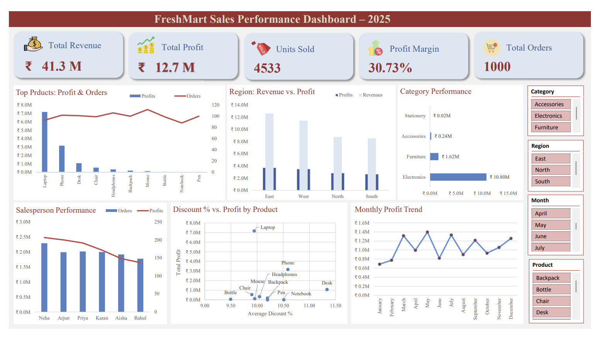

# 📊 FreshMart Sales Performance Dashboard – 2025

## Project Overview
This is my first hands-on Excel Data Analysis mini project, built as part of my journey toward becoming a Data Analyst.

The objective of this project was to create an interactive sales dashboard that transforms raw sales data into meaningful business insights using Microsoft Excel.

---

## Dashboard Preview

---

## Objectives
- Analyze product performance
- Identify top-performing regions
- Evaluate salesperson performance
- Track monthly profit trends
- Analyze the relationship between discounts and profitability

---

## Tools Used
- Microsoft Excel

---

## Skills Demonstrated
- Data Cleaning & Validation
- Pivot Tables
- Pivot Charts
- KPI Cards
- Interactive Slicers
- Dashboard Design
- Data Visualization
- Business Analysis

---

## Key Insights
- Electronics generated over 85% of the company's total profit.
- Laptop contributed 56.63% of total profit despite having only 93 orders.
- East region generated the highest revenue and profit.
- Monthly profit peaked in May at approximately ₹1.4M.
- Neha was the top-performing salesperson, recording the highest number of orders (191), and generating the highest total profit (₹24.82 lakh).
- Discounting is roughly flat across products (~10%), so profit differences are driven by product strength, not discount depth.
- Top selling products by volume were Mouse, Headphones, Desk, Backpack, and Phone.		

---

## Business Recommendations
- Double down on Electronics and East region — they're the clear profit engines and deserve priority in inventory and marketing.
- Reassess discount strategy on low performers (Desk, Bottle, Notebook, Pen) and replicate Neha's sales approach across the team.
- Prepare for seasonal demand around May and protect current strategy on top earners (Laptop, Phone).

---

## Files
- 📄 FreshMart_Dashboard_Excel.xlsx
- 📄 FreshMart_Dashboard_Pdf.pdf
